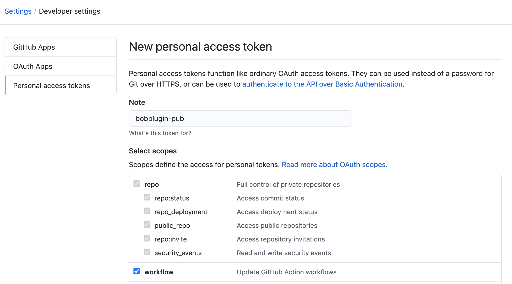
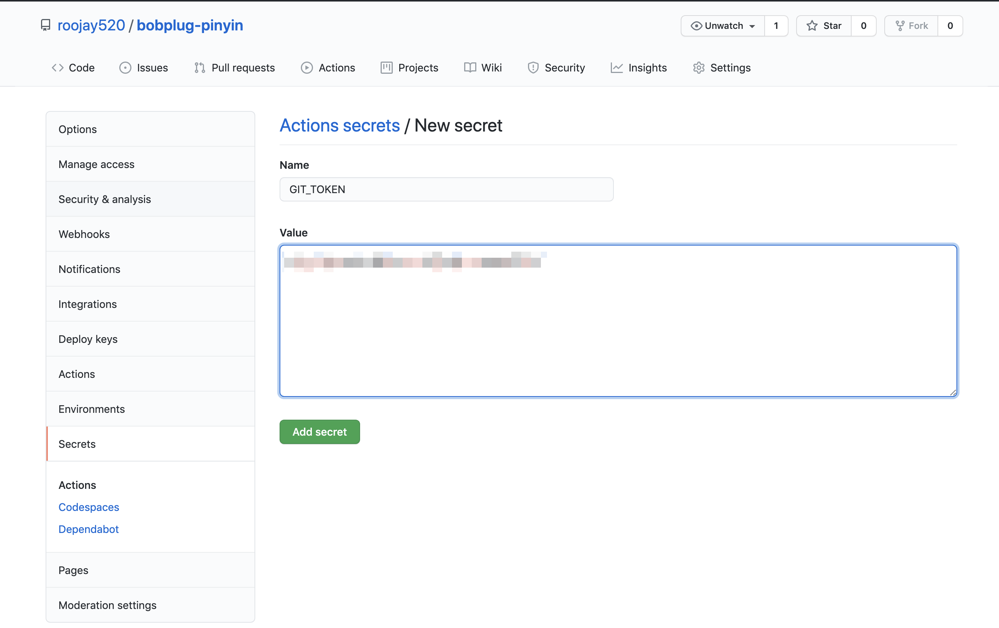

# `@bob-plug/cli`

> @bob-plug/cli 一个方便创建插件模板的 cli 工具

## 前置依赖

运行环境: [Node.js](https://nodejs.org/): "^12.20.0 || ^14.13.1 || >=16.0.0"
包管理工具: [yarn](https://classic.yarnpkg.com/en/docs/install)

## 使用

1. 安装 cli 工具

```bash
yarn global add @bob-plug/cli
```

2. 创建项目

```bash
bob create [项目名]
```

3. 进入项目目录, 安装依赖, 运行项目

```bash
cd [项目名]
yarn install
yarn run dev
```

## 示例

> 创建一个汉字转拼音的插件[bobplug-pinyin](https://github.com/roojay520/bobplug-pinyin)

1. 创建项目

```bash
bob create bobplug-pinyin
```


- 选择对应模板
- 输入作者的用户名(最好输入你的 Github 的用户名, 便于后面仓库地址的生成)
- 输入插件在 Bob 里面的展示标题
- 输入描述
- 回车确认即可创建

此时会在当前的目录下生成一个 `bobplug-pinyin` 项目, 目录结构如下:

```bash
./bobplug-pinyin
├── CHANGELOG.md
├── LICENSE
├── README.md
├── package.json
├── rollup.config.js     // 打包设置
├── scripts
│   ├── build-zip.js     // 最终压缩
│   ├── config.js        // 自定义配置文件
│   ├── init-appcast.js  // 根据配置文件生成 appcast.json
│   └── init-info.js     // 根据配置文件生成 info.json
├── src
│   ├── appcast.json    // 根据配置自动生成
│   ├── info.json       // 根据配置自动生成
│   ├── lang.ts         // 语言相关设置
│   ├── libs            // 需要使用 Bob 方式的本地库
│   ├── main.ts         // 入口文件
│   ├── translate.ts    // 实现具体翻译逻辑的文件
│   └── util.ts         // 工具类
├── tsconfig.eslint.json
├── tsconfig.json
└── yarn.lock
```

2. 安装依赖
   > 安装相关依赖项, 并更新 `info.json`文件

```bash
yarn install
```

3. 开发项目

```bash
yarn run dev
```

- 自动生成 `dist/bobplug-pinyin.bobplugin` 文件夹, 在 `Finder` 里面双击即可安装为 `Bob` 插件。
- `dist` 下的文件是根据 `src` 目录下的源文件自动生成的, 并且是实时更新的, 在 `dist` 下做的修改操作都会被覆盖。

4. 编译打包(如果使用用 Github Action 自动发布则省略此步操作)

更新 `package.json` 文件里面的 `version` 字段后, 执行打包命令

```bash
yarn run build
```

- 此时会在项目根目录下自动生成 `release` 文件, 其中包含 `bobplug-pinyin-v0.0.1.bobplugin` 的文件, 此文件即为最终的插件安装包。

## 利用 Github Action 自动打包发布

配置了 Github Action 后, 每次只需要提交带 [git tag](https://git-scm.com/book/zh/v2/Git-%E5%9F%BA%E7%A1%80-%E6%89%93%E6%A0%87%E7%AD%BE) 的记录即可自动打包发布。

1. 创建一个新的 Github 仓库, 生成一个新的 [new token](https://github.com/settings/tokens/new)
   
2. 将这个 `token` 添加到你的插件仓库(Settings > Secrets > New repository secret), 配置一个名为 `GIT_TOKEN` 的 `secrets` 
3. 项目发布到线上仓库, 在当前项目根目录下执行以下命令

```bash
# 初始化仓库
git init && git add .

# 提交文件
git commit -m "feat: 初始化项目"

# 链接到远程仓库, !注意: 下面仓库地址填自己创建的
git remote add origin https://github.com/roojay520/bobplug-pinyin.git

# 推送到远端仓库
git push --set-upstream origin master

```

后续更新文件

```bash
# 更新自动生成的版本更新文件
git pull origin master --rebase

# 提交更改
git add . && git commit -m "feat: 添加新功能"

# 生成 tag 版本标记和 changelog 文件, 触发 github action 自动发布
# 如果需要发布新版本执行, 例如更新文档之类的可跳过此步骤
yarn version

# 推送包含 tag 的记录到 github 仓库
git push --follow-tags origin master
```
